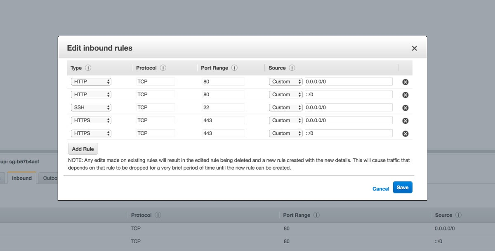
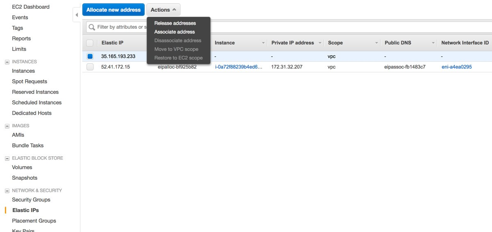
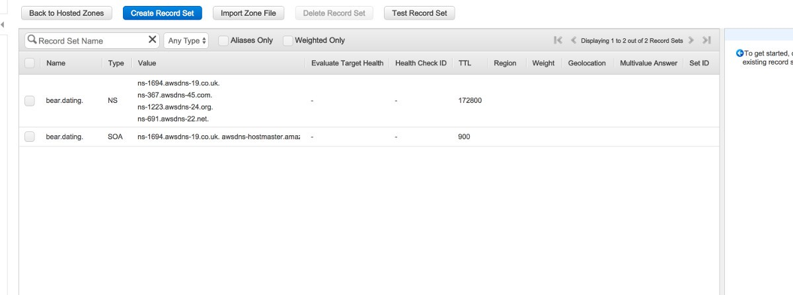

# Deploy an https server with AWS EC2, Nginx and Let's Encrypt.

This tutorial will teach how to deploy a safety https ec2 server step by steps. At here, we use the **Let's Encrypt** package, which is a tool for automatically deploy website with TLS/SSL certificate.

## Define some terminology in this tutorial

* **Let's encrypt**: is a certificate authority (CA) that provides free digital certificates to allow HTTPS on websites.

* **Nginx**: is a web server that can be used also as load balancer, reverse proxy, mail proxy and HTTP cache.

* **HTTPS**: (Hyper Text Transfer Protocol Secure) is an implementation of the HTTP protocol over an additional security layer that uses the SSL/TLS protocol.

* **SSL/TLS protocol**: Transport Layer Security (TLS) and its predecessor, Secure Sockets Layer (SSL) (which is now deprecated) are application protocols that provide communications security over a computer network.

* **Certbot**: is a client (tool) that runs on the server to fetch and deploy SSL certificates.

# Setup EC2 instance.

Make sure you have aws account, then in your `Console Home Page` chick the `EC2` link at `Services` dropdown. Chick the `Launch Instance` button. Configuration your EC2 instance by the following steps.

1. **Choose an Amazon Machine Image (AMI)**, choice the `free tier eligible` labeled instance which will no charge bill in the first year of newer at AWS, here I use `Ubuntu Server 16.04 LTS(HVM), SSD Volume Type` as my virtual machine.

2. **Choose an Instance Type** Leave it at `General purpose t2.micro free tier eligible`. And then chick the buttion of `Next: Configure Instance Details`.

3. **Configure Instance Details** Use the default setting, chick `Next Add Storage` button.

3. **Add Storage** Use the default setting, chick `Next Add Tags`

4. **Add Tags** If you have launched many instance, this will help your to identify you virtual machine usage. Here you named as `my-key` and `my-value`.

5. **Configure Security Group** Choice thr radio button labeled `create a new security group` and you can give a name and description. Add the HTTP and HTTPs type by default Protocol and Port Range. Then repeat this with HTTPS instead of HTTP and save. Like the following:

Chick `Review and Launch`.

6. **Review Instance Launch** Chick the `Launch` button then you will see a window popup. Choice the `Create a new key pair` and type in a name or use the exist key pair for launch thi instance. Just make sure you have the key pair correctly at your localhost.

# Set up an Elastic IP for your instance

On the left of the Instance dashboard, click **Elastic IPs** then **Allocate new address**. Once you create that IP then navigate back to the main `Elastic IPs` page, select the new IP the click **Actions** at top of the panel, choice the **Associate address**.


You can select your instance and private instance IP then make the association. When you go back to **Instances**, the **Description** panel will show your new IP address next to `IPv4 Public IP`. Copy this IP address somewhere.

# Link Elastic IP to your domain

Setup a Hosted Zone through the `Amazon Route 53` to get Name servers for your domain that point to you new `Elastic IP` address.

Go to the `Route 53` page, click **Hosted zones** on the left panel, then click **Create Hosted Zone**. Enter your domain then click `Create`, Remember the input format of your domain will be like `<domain name>.com`. You'll be navigated here:

Click **Create Record Set**. Leave the **Name** field blank and put your `Elastic IP` in the `Value` field, then click **Create**. Repeat this step, this time input the `www` into the **Name** field. Put your IP in the **Value** field again.

At the end, you will have four record sets now, two Type of `A`, one `NS` and one `SOA`. Use the `NS` Name Servers values to edit you domain register Name servers values. After a bit, your domain should now go to your instance. 

# Connect to your instance

On your local machine, go to your root directory, store the `key.pem` file to the directory of `~/.ssh/`.

Run `chmod -R 400 ~/.ssh/key.pem` for change your key pair mode.

Then run
```bash
$ ssh -i ~/.ssh/key.pem ubuntu@<elastic ip>
```
connect to your aws virtual machine.

# Install Nginx and Chertbot

After connect to your instance, Type the following command to install the Nginx:
```bash
$ sudo apt-get update
$ sudo apt-get install nginx
```
After the installing, you can access your domain and check that something is already available (Without HTTPS).

Use the Certbot repository to get up-to-date versions of the packages.
```bash
$ sudo add-apt-repository ppa:certbot/certbot
$ sudo apt-get update
$ sudo apt-get install python-certbot-nginx
```
Before ues the Certbot to generate you need to change a line in the NGINX config file. Go to `/etc/nginx/site-available/`, open the `default` file an change the `server_name` line, with your domain. it look like:
```
server_name graphqlexample.com www.graphqlexample.com;
```
Then restart you nginx service.
```bash
$ sudo service nginx restart
```

# Generate certificate and configure Nginx

Finally, let's make Certbot get a certificate and configure it automatically to us:
```bash
$ sudo certbot --nginx -d graphqlexample.com -d www.graphqlexampl.com
```
For this step, you will be ask to input your email which will receive the notification of the certificate expiration. Then you have two options: Redirect or not the requests from HTPP to HTTPS. I chose to Redirect. After those step, you can check you domain can work with the https protocol.

For the safety, your should configure the Nginx and the firewall like this.
```bash
$ sudo ufw default deny incoming
$ sudo ufw default allow outgoing
$ sudo ufw allow ssh
$ sudo ufw allow 'Nginx HTTP'
$ sudo ufw allow 'Nginx HTTPS'
$ sudo ufw enable
$ sudo ufw status (should say active)
$ sudo nginx -t
```
