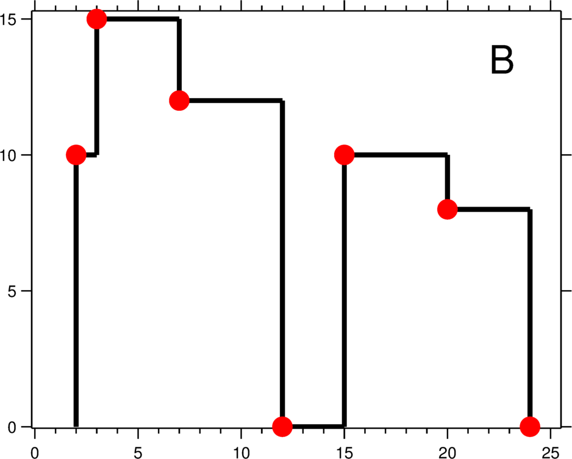

# The Skyline Problem
A city's skyline is the outer contour of the silhouette formed by all the buildings in that city when viewed from a distance. Now suppose you are given the locations and height of all the buildings as shown on a cityscape photo (Figure A), write a program to output the skyline formed by these buildings collectively (Figure B).

 

The geometric information of each building is represented by a triplet of integers `[Li, Ri, Hi]`, where Li and Ri are the x coordinates of the left and right edge of the ith building, respectively, and Hi is its height. It is guaranteed that `0 ≤ Li, Ri ≤ INT_MAX, 0 < Hi ≤ INT_MAX`, and `Ri - Li > 0`. You may assume all buildings are perfect rectangles grounded on an absolutely flat surface at height 0.

For instance, the dimensions of all buildings in Figure A are recorded as: `[ [2 9 10], [3 7 15], [5 12 12], [15 20 10], [19 24 8] ]` .

The output is a list of "key points" (red dots in Figure B) in the format of `[ [x1,y1], [x2, y2], [x3, y3], ... ]` that uniquely defines a skyline. A key point is the left endpoint of a horizontal line segment. Note that the last key point, where the rightmost building ends, is merely used to mark the termination of the skyline, and always has zero height. Also, the ground in between any two adjacent buildings should be considered part of the skyline contour.

For instance, the skyline in Figure B should be represented as:`[ [2 10], [3 15], [7 12], [12 0], [15 10], [20 8], [24, 0] ]`.

**Notes:**
```
The number of buildings in any input list is guaranteed to be in the range [0, 10000].
The input list is already sorted in ascending order by the left x position Li.
The output list must be sorted by the x position.
There must be no consecutive horizontal lines of equal height in the output skyline. For instance, [...[2 3], [4 5], [7 5], [11 5], [12 7]...] is not acceptable; the three lines of height 5 should be merged into one in the final output as such: [...[2 3], [4 5], [12 7], ...]
```

# The heap approach


```python
from heapq import heappop, heappush
def getSkyline(buildings):
    scan = []
    for b in buildings:
        scan.append([b[0], -b[2]])
        scan.append([b[1], b[2]])
    # sort the building base on x corrdination.
    # start is -height, end is height
    scan = sorted(scan, key = lambda i: (i[0], i[1]))
    
    pq = [0]
    current_h = 0
    ignored_h = {}
    ans = []
    for build in scan:
        if build[1] < 0:
            # if its a start height, we will store it into our heap.
            # store the -height into min heap
            heappush(pq, build[1])
        else:
            # store need remove height into ignored. (height, 1) 
            ignored_h[build[1]] = ignored_h.get(build[1], 0) + 1

        while -pq[0] in ignored_h and ignored_h[-pq[0]] >= 1:
            ignored_h[-pq[0]] -= 1
            heappop(pq)
        
        if current_h != -pq[0]:
            ans.append([build[0], -pq[0]])
            current_h = -pq[0]
    return ans
```


```python
getSkyline([[2,9,10],[3,7,15],[5,12,12],[15,20,10],[19,24,8]])
```


    [[2, 10], [3, 15], [7, 12], [12, 0], [15, 10], [20, 8], [24, 0]]


```python
import timeit
timeit.timeit("getSkyline([[2,9,10],[3,7,15],[5,12,12],[15,20,10],[19,24,8]])", number=100, globals=globals())
```


    0.006631889031268656


Our sorted will cost `O(nlogn)` and `heappop()` and `heappush()` will both cost `O(logn)` time complexity. So our total time complexity will be `O(nlogn)`. As we use the extra space to store the end of each building, they will be `O(n)` space complexity.

# Divide and Conquer approach


```python
def getSkyline_divde(buildings):
    def divide(buildings):
        if not buildings:
            return []
        if len(buildings) == 1:
            return [[buildings[0][0], buildings[0][2]], [buildings[0][1], 0]]
        
        mid = len(buildings) // 2
        left = divide(buildings[:mid])
        right = divide(buildings[mid:])
        return merge(left, right)
    
    def update_output(output, x, max_h):
        if not output or output[-1][0] != x:
            output.append([x, max_h])
        else:
            output[-1][1] = max_h
    
    def append_left_skyline(output, arr, idx, length):
        while idx < length:
            x, h = arr[idx]
            update_output(output, x, h)
            idx += 1
    
    def merge(left, right):
        l_idx, r_idx = 0, 0
        len_l, len_r = len(left), len(right)
        current = 0
        left_h, right_h = 0, 0
        output = []
        while l_idx < len_l and r_idx < len_r:
            if left[l_idx][0] < right[r_idx][0]:
                x, left_h = left[l_idx]
                l_idx += 1
            else:
                x, right_h = right[r_idx]
                r_idx += 1
            max_h = max(left_h, right_h)
            if current != max_h:
                update_output(output, x, max_h)
                current = max_h
        append_left_skyline(output, left, l_idx, len_l)
        append_left_skyline(output, right, r_idx, len_r)
        return output
    return divide(buildings)
```


```python
getSkyline_divde([[1,2,1],[1,2,2],[1,2,3]])
```


    [[1, 3], [2, 0]]


```python
timeit.timeit("getSkyline_divde([[2,9,10],[3,7,15],[5,12,12],[15,20,10],[19,24,8]])", number=100, globals=globals())
```


    0.005977749009616673


